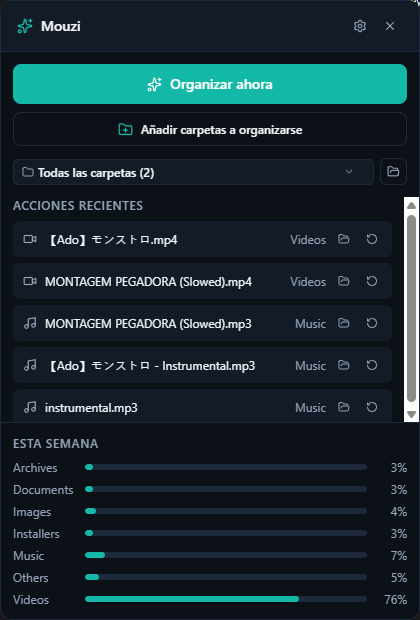
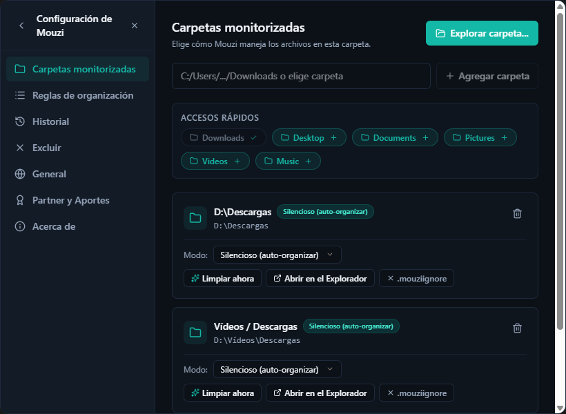
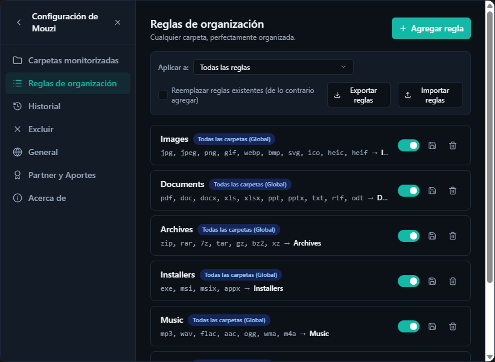

# MouziFlow 🧹🐁

> **Organizador de descargas y archivos inteligente, ligero y 100% privado.**

[](https://github.com/biglexj/MouziFlow/releases/latest)
[](https://github.com/biglexj/MouziFlow/releases/latest)
[](https://v2.tauri.app)
[](https://www.rust-lang.org)
[](https://react.dev)
[](LICENSE.md)
[](https://www.biglexj.com/desarrollo)

> [!NOTE]
> **MouziFlow** es un fork y evolución del proyecto [Mouzi](https://github.com/hsr88/mouzi) creado originalmente por [@hsr88](https://github.com/hsr88). Este proyecto incorpora mejoras ergonómicas profundas: nuevos selectores personalizados con tema oscuro, arrastre de ventana sin marco en Windows 11, aislamiento de entorno de desarrollo y distribución oficial mediante el ecosistema [biglexj.com](https://www.biglexj.com/desarrollo).

---

## 📸 Capturas de Pantalla

| Panel Principal (Popup) | Carpetas Monitorizadas |
| :---: | :---: |
|  |  |

| Reglas de Organización | Donaciones y Soporte |
| :---: | :---: |
|  |  |

| Acerca de MouziFlow |
| :---: |
|  |

---

## 🌟 Novedades y Aportes de MouziFlow

A diferencia de la versión base, MouziFlow introduce las siguientes mejoras:

- 🎨 **Selectores Desplegables Dark Mode (`CustomSelect`)**:
  - Reemplazo total de los `<select>` nativos grises de Windows por desplegables modernos con animación de chevron a 180°, marcas de verificación activas y soporte de rutas e iconos.
  - Implementado en el selector de carpetas del Popup y en todos los paneles de Configuración (filtros de reglas, modos de carpeta, idiomas, temas y exclusiones).
- 🪟 **Arrastre Fluido de Ventana en Windows 11 (Dual-Layer)**:
  - Solución al problema de ventanas flotantes sin marco (`decorations: false`) de Tauri v2.
  - Integración nativa con `startDragging()` combinada con seguimiento físico de cursor throttled por `requestAnimationFrame` mediante comandos en Rust.
- 🛡️ **Aislamiento Total de Desarrollo vs. Producción**:
  - Socket de instancia única separado (`cc.mouzi.dev`), base de datos aislada (`mouzi-dev`) y sufijo `[DEV]` en bandeja para programar sin interferir con la app instalada.
- ⚡ **Instancia Única Optimizada (Win32)**:
  - Detección inmediata de procesos duplicados mediante Mutex y Eventos Win32 nativos que traen la ventana existente al frente al instante.
- 📦 **Empaquetado Oficial Unificado con Icono Embebido**:
  - Instalador NSIS con el icono canónico de MouziFlow integrado en el binario del instalador y desinstalador.

---

## 📥 Descargas Oficiales

### MouziFlow (Versión Recomendada)

| Archivo | Plataforma | Tipo | Enlace |
| :--- | :--- | :--- | :--- |
| **`Mouzi_0.2.0_x64-setup.exe`** | Windows 10 / 11 (x64) | Instalador oficial | [Descargar de GitHub Releases](https://github.com/biglexj/MouziFlow/releases/download/v0.2.0/Mouzi_0.2.0_x64-setup.exe) |
| **Ficha en Aurora** | Web / Blog | Detalles y notas | [Ver en biglexj.com](https://www.biglexj.com/desarrollo) |

**Sumas de integridad (SHA-256):**
```text
77d89dcca932db921644d6f3eb420692085a05c5b15fd30450b95174b814df13  Mouzi_0.2.0_x64-setup.exe
```

> ℹ️ **Requisitos en Windows:** Windows 10 (1809+) o Windows 11. Requiere el runtime WebView2 de Microsoft Edge (preinstalado en casi todas las versiones modernas de Windows).

---

### Proyecto Original Upstream (Mouzi)

Si buscas la versión original sin las modificaciones de MouziFlow, puedes consultar el repositorio y canales de su autor original:

- **Repositorio original:** [github.com/hsr88/mouzi](https://github.com/hsr88/mouzi)
- **Sitio web upstream:** [mouzi.cc](https://mouzi.cc)

---

## ✨ Características Principales

### 🔇 Silencioso y Eficiente
- Se ejecuta las 24 horas en segundo plano con un consumo mínimo (~5 MB de RAM).
- Organiza archivos automáticamente conforme caen en las carpetas vigiladas.
- Notificaciones sutiles de Windows con el resumen de archivos organizados.
- Inicio silencioso con Windows mediante parámetro `--autostart`.

### 📁 Motor Inteligente de Reglas
- **Imágenes** (`.jpg`, `.png`, `.gif`, `.webp`...) → `Descargas/Images/`
- **Documentos** (`.pdf`, `.docx`, `.xlsx`...) → `Descargas/Documents/`
- **Comprimidos** (`.zip`, `.rar`, `.7z`...) → `Descargas/Archives/`
- **Instaladores** (`.exe`, `.msi`...) → `Descargas/Installers/`
- **Música y Vídeo** → Carpetas dedicadas
- Reglas generales comodín para archivos restantes.

### 🛠️ Totalmente Personalizable
- Crea tus propias reglas con extensiones, expresiones regulares y carpetas de destino personalizadas.
- Marcadores de posición dinámicos: `{year}`, `{month}`, `{day}`, `{extension}`, `{filename}`.
- Reordena reglas por prioridad: la primera que coincide procesa el archivo.

### 🚫 Reglas de Exclusión (.mouziignore)
- Patrones de exclusión por carpeta (equivalente a un `.gitignore`).
- Compatible con comodines (`*.tmp`), nombres exactos (`.DS_Store`) y carpetas enteras (`node_modules/`).

### 📂 Modos de Monitoreo
Cada carpeta puede operar en:
- **Silencioso:** organiza los archivos al instante.
- **Manual:** agrupa los archivos y solo los mueve al pulsar **Organizar ahora**.
- **Pausado:** mantiene la carpeta visible pero no realiza ningún movimiento.

### 📜 Historial y Deshacer Inmediato
- Registro completo en SQLite local.
- Botón de deshacer rápido con 1 clic para revertir cualquier movimiento erróneo.

---

## 🛠️ Desarrollo y Compilación

### Requisitos Previos
- [Node.js](https://nodejs.org/) 22+ o [Bun](https://bun.sh/)
- [Rust](https://rustup.rs/) (versión stable)
- Visual Studio Build Tools con componentes de C++ / Windows SDK

### Instalación Local

```bash
# Clonar el repositorio
git clone https://github.com/biglexj/MouziFlow.git
cd MouziFlow

# Instalar dependencias
bun install

# Iniciar entorno de desarrollo (con aislamiento dev activado)
bun run tauri:dev
```

### Compilación para Producción

```bash
# Compilar frontend y backend, empaquetar NSIS y generar sumas SHA-256 en release/
bun run tauri:build
```

Los artefactos se depositan en el directorio [`release/`](release/).

---

## 📄 Licencia

MouziFlow está publicado bajo la [Licencia MIT](LICENSE.md).

---

## 🙏 Agradecimientos y Créditos

- A [@hsr88](https://github.com/hsr88) por la creación y concepto original de [Mouzi](https://github.com/hsr88/mouzi).
- Construido sobre [Tauri v2](https://v2.tauri.app), [Rust](https://www.rust-lang.org), [React](https://react.dev) y [Tailwind CSS](https://tailwindcss.com).
